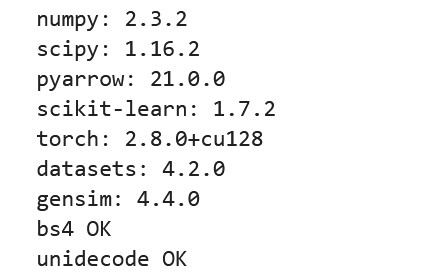
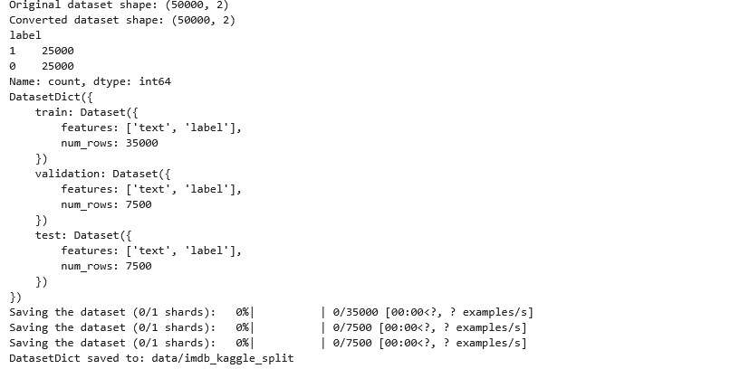
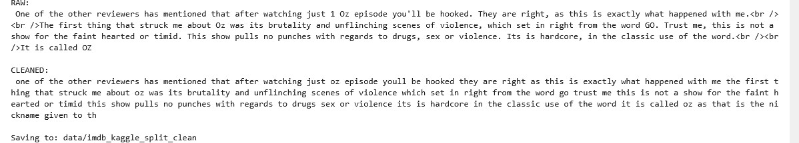
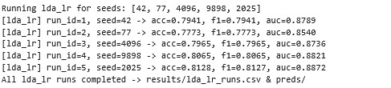
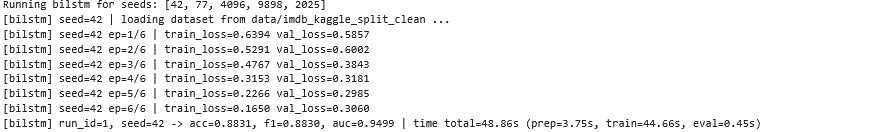
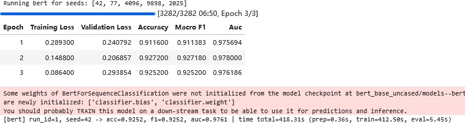
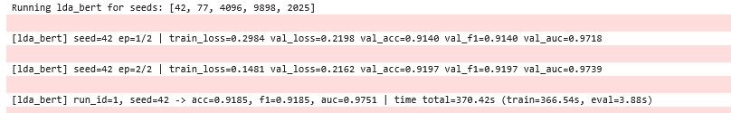
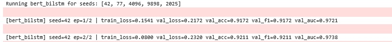
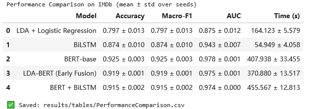
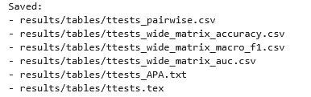

# CPS4951-Capstone
Capstone code and database
## 🎬 IMDb Sentiment Analysis
## 1. Project Overview
This repository implements sentiment classification on the IMDb dataset and compares following model:
- **LDA + Logistic Regression**
- **BiLSTM**
- **BERT**
- **LDA-BERT**
- **BERT-BiLSTM**<br>
Each model is trained and evaluated across multiple fixed random seeds to ensure experimental reproducibility.
After training, the framework automatically computes and records several key performance metrics, including Accuracy, Macro-F1, AUC, and Running Time.
To assess statistical significance, paired t-tests are conducted between models.
In addition, detailed error analysis is performed to identify false positives and false negatives, followed by the generation of confusion matrices and ROC curves for visual comparison.

Overall, this project aims to explore the performance, efficiency, and reliability trade-offs among classical, deep, and hybrid NLP models under a controlled experimental setting.

## 🧱 Project Structure 
### 📂 Before Running 
```bash
.
├── IMDB Dataset.zip          # Raw IMDb dataset 
├── bert-base-uncased.zip     # Offline BERT model snapshot
├── code.ipynb                # Main notebook for experiments 
├── environment.yml           # Conda environment definition
├── requirements.txt          # pip dependency list
└── README.md                 # Project documentation 
```

## ⚙️ Environment Setup

There are two ways to set up the environment for this project:

1. Using **pip** with `requirements.txt`
2. Using **Conda** with the provided `environment.yml`

It is recommended to install dependencies using **pip** for simplicity and speed.
If any environment conflicts occur (e.g., CUDA or PyTorch version issues), you may alternatively use **Conda**.

### 🔹 Option A — Using pip
```bash
# Install all dependencies
pip install -r requirements.txt
```

### 🔹 Option B — Using Conda
```bash
# Create a new environment
conda env create -f environment.yml
# Activate the environment
conda activate imdb-sentiment
```

### 🔸 Prepare Offline Files

```bash
# Unzip IMDb dataset
unzip "IMDB Dataset.zip" -d data/

# Unzip BERT base model snapshot
unzip "bert-base-uncased.zip"
```
## 🚀 Running the Project

After setting up the environment and unzipping the dataset and model files,  
you can run all experiments directly from the Jupyter Notebook.

### 🔹 Step 1 — Launch Jupyter Notebook
```bash
jupyter notebook
```
### 🔹 Step 2 — Open the Notebook
```bash
# Open the file:
code.ipynb
```
### 🔹 Step 3 — Run All Cells
Run all cells in sequence.
The notebook will automatically:
  load and preprocess the IMDb dataset,
  train and evaluate five models (LDA+LR, BiLSTM, BERT, LDA-BERT, BERT-BiLSTM),
  repeat experiments across five random seeds [42, 77, 4096, 9898, 2025],
  compute metrics including Accuracy, Macro-F1, AUC, and Running Time,
  perform paired t-tests and error analysis,
  generate confusion matrices and ROC curves
### 🔹 Step 4 — Check the Outputs
All results are automatically saved under the results/ directory:
```bash
results/
├──<model><seeds>_learn.csv
├──<model>_run.csv
├── preds/          # per-seed prediction files
├── figs/           # ROC & confusion matrix plots
├── tables/         # summary tables (mean/std, t-tests)
├── final_preds/    # aggregated results
└── error_samples/  # misclassified samples for analysis
```
## 📊 Example Outputs
### 🔹 Step 1 — Check the base lib
Prepore for load data<br>

### 🔹 Step 2 — load data and split
50000->35000/7500/7500<br>

### 🔹 Step 3 — Clean data and save split dataset
Remove HTML tags, URLs, punctuation, digits.
Convert to lowercase and normalize whitespace.
Add a backup column text_raw to preserve original text.
Filter out empty or whitespace-only samples.

### 🔹 Step 4 — LDA


### 🔹 Step 5 — BiLSTM


### 🔹 Step 6 — BERT


### 🔹 Step 7 — LDA-BERT


### 🔹 Step 8 — BERT-BiLSTM


### 🔹 Step 9 — Output summary.csv


### 🔹 Step 10 — Error simple, ROC & Confusion Martix


### 🔹 Step 11 — pring figure from result 


## 🏁 Results Summary

Deep learning models significantly outperformed the traditional LDA + Logistic Regression baseline on the IMDb sentiment analysis task.  
Among all models, **BERT** achieved the highest performance (Accuracy = 0.9272, Macro-F1 = 0.9272, AUC = 0.9784).  
Hybrid architectures such as **LDA-BERT** and **BERT-BiLSTM** did not surpass single BERT, likely due to feature redundancy and weak fusion design.  
Overall, BERT proved to be the most effective and efficient approach, while future work can explore improved fusion strategies or more complex datasets.


## ⚖️ License
This project is released under the MIT License.  
Feel free to use and modify the code with proper attribution.


